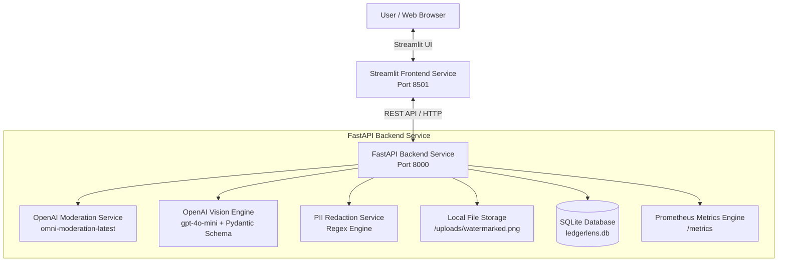
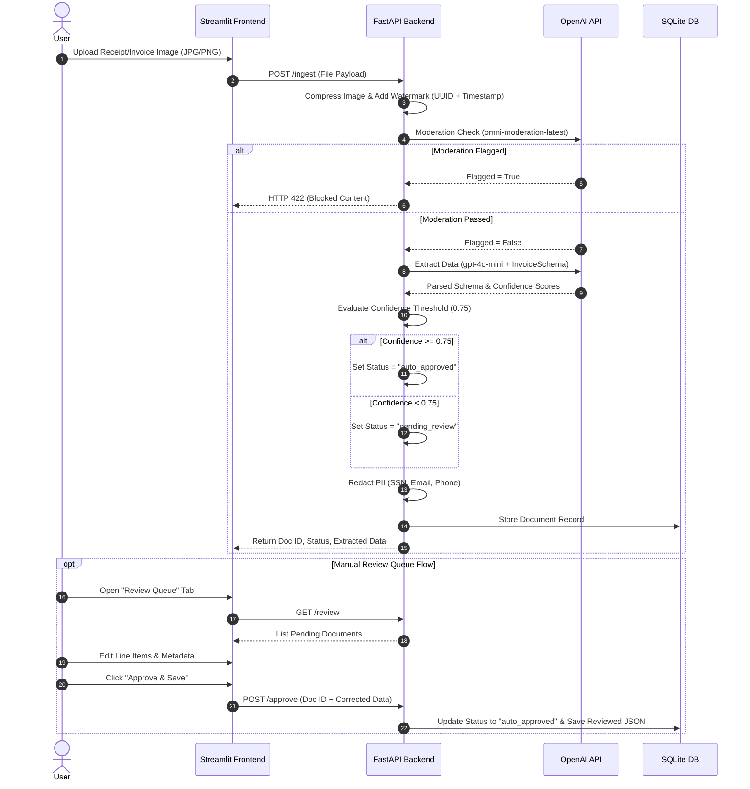

# 🔍 Invoice Lens — AI-Powered Invoice & Document Intelligence Platform

[](https://ledgerlens-frontend-w7d6.onrender.com/)
[](https://python.org)
[](https://fastapi.tiangolo.com)
[](https://streamlit.io)
[](https://www.docker.com)

> 🚀 **Live Production Application:** [https://ledgerlens-frontend-w7d6.onrender.com/](https://ledgerlens-frontend-w7d6.onrender.com/)

---

**Invoice Lens** is an enterprise-grade AI-powered invoice processing and document intelligence application that automates invoice data extraction, manual review queue management, sensitive data redaction, document history tracking, and financial analytics.

Built using **FastAPI**, **Streamlit**, **SQLite**, and **OpenAI GPT Vision Engine**, Invoice Lens transforms raw, unstructured invoice and receipt images into structured, auditable financial data.

---

## 📌 Table of Contents
1. [Features Breakdown](#-features-breakdown)
    - [Invoice Processing](#-invoice-processing)
    - [AI Extraction](#-ai-extraction)
    - [Manual Review (Human-in-the-Loop)](#-manual-review-human-in-the-loop)
    - [Dashboard & Analytics](#-dashboard--analytics)
    - [Document Management](#-document-management)
    - [Logging & Observability](#-logging--observability)
    - [Error Handling & Security](#-error-handling--security)
2. [Technology Stack](#-technology-stack)
3. [Application Architecture](#-application-architecture)
4. [End-to-End System Workflow](#-end-to-end-system-workflow)
5. [Project Structure](#-project-structure)
6. [Environment Variables](#-environment-variables)
7. [Step-by-Step Running & Setup](#-step-by-step-running--setup)
    - [Option 1: Native Python Setup](#option-1-native-python-setup)
    - [Option 2: Docker Compose Setup(Recommended)](#option-2-docker-compose-setup)
8. [Step-by-Step Deployment Guide (Render)](#-step-by-step-deployment-guide-render)
9. [API Endpoints](#-api-endpoints)
10. [Observability & Testing](#-observability--testing)

---

## ✨ Features Breakdown

### 📄 Invoice Processing
- **Multi-Format Upload**: Upload invoice and receipt images (JPG, JPEG, PNG).
- **Automated Processing**: Instant processing upon upload via Vision API.
- **Image Compression & Watermarking**: Scales images and burns unique UUID document IDs and ISO timestamps directly onto the image.
- **Database Persistence**: Stores raw and reviewed document metadata in SQLite.

---

### 🤖 AI Extraction
Automatically extracts structured financial fields with confidence scores using OpenAI GPT Vision models:
- **Vendor / Merchant Name**
- **Invoice / Receipt Number**
- **Invoice Date** (formatted as YYYY-MM-DD)
- **Currency** (3-letter currency code)
- **Subtotal & Tax**
- **Total Amount**
- **Line Items**: Description, Quantity, Unit Price, Amount, and Line-Item Confidence Score
- **Overall Confidence Score**: Used for automated routing decisions.

---

### ✍️ Manual Review (Human-in-the-Loop)
- **Pending Queue Routing**: Low-confidence extractions (`< 75%`) are automatically flagged for review.
- **Visual Verification**: View original watermarked receipt side-by-side with extracted values.
- **Line-Item & Metadata Editing**: Edit vendor, amounts, dates, and line items directly in the UI.
- **Strict Input Validation**: Validates all user inputs on metadata and line items to block `null`, `None`, `NaN`, or empty string submissions.
- **Line Item Row Controls**: Add new line items or explicitly remove specific/accidental rows using dedicated deletion controls.
- **Status Approval**: Approve and save corrected records to update the document state to `auto_approved`.

---

### 📊 Dashboard & Analytics
- **Total Documents Metrics**: Total uploaded, processed, auto-approved, and pending review counts.
- **Financial Analytics**: Total cumulative invoice expenditure and average AI confidence score.
- **Visual Charts**: Status distribution charts and daily upload volume trends.

---

### 🗄️ Document Management
- **Searchable Historical Ledger**: Browse all processed invoices.
- **Filtering & Search**: Search by vendor name or filename, and filter by status (`auto_approved`, `pending_review`).
- **Dynamic JSON Views**: Dedicated modal views for Extracted JSON (`🤖 Extracted JSON Data`) and Human-Reviewed JSON (`🧑‍💻 Reviewed JSON Data`).
- **Pagination & Sorting**: Paginated data grid with creation timestamp sorting.

---

### 📈 Logging & Observability
- **Prometheus Metrics**: Real-time tracking of extraction latency, moderation latency, token cost in USD, and document throughput.
- **Structured System Logs**: Backend logging for uploads, AI calls, database transactions, and errors.

---

### 🛡️ Error Handling & Security
- **Frontend Access Token Gate**: Protects dashboard access with environment-configured secret token (`ACCESS_TOKEN`).
- **Content Moderation Gate**: Passes images through OpenAI's `omni-moderation-latest` to block unsafe or non-document content.
- **PII Redaction Engine**: Automatically redacts sensitive information (SSN, emails, phone numbers) before database insertion.
- **Rate Limit Resilience**: Automatic exponential backoff retries for OpenAI API rate limits (`429`).
- **Global Exception Handling**: Returns clear HTTP status codes and structured validation errors.

---

## 🛠️ Technology Stack

### Backend
- **FastAPI**: Asynchronous Python web framework for REST APIs.
- **OpenAI API (`gpt-4o-mini`)**: Structured vision model parsing using Pydantic schemas.
- **Pillow (PIL)**: Image resizing, compression, and watermarking.
- **SQLite3**: Embedded relational database with schema auto-migrations.
- **Prometheus Client**: Metrics instrumentation for performance and API costs.

### Frontend
- **Streamlit**: Interactive web dashboard framework.
- **Pandas**: Data manipulation and table formatting.
- **Requests**: HTTP client for communicating with FastAPI backend.

### Infrastructure & DevOps
- **Docker & Docker Compose**: Multi-container orchestration.
- **Pytest**: Automated testing for schema contracts and endpoints.
- **Render**: Containerized cloud hosting.

---

## 🏗️ Application Architecture



---

## 🔄 End-to-End System Workflow



---

## 📁 Project Structure

```
LedgerLens/
├── backend/
│   ├── api/
│   │   └── routes.py           # FastAPI endpoints (/ingest, /review, /approve, /documents, /health)
│   ├── database/
│   │   ├── config.py           # SQLite database connection & migrations
│   │   └── crud.py             # CRUD queries for document table
│   ├── services/
│   │   ├── pii_redaction.py    # PII masking (SSN, email, phone regex)
│   │   └── vision.py           # OpenAI vision API integration & rate-limit backoff
│   ├── main.py                 # FastAPI application root & Prometheus mounting
│   └── schemas.py              # Pydantic models (InvoiceSchema, LineItem)
├── frontend/
│   ├── components/
│   │   └── dialogs.py          # Streamlit UI dialog helpers
│   ├── services/
│   │   ├── api_client.py       # API HTTP client wrapper
│   │   └── auth.py             # Access token verification & env loader
│   ├── views/
│   │   ├── dashboard.py        # Analytics overview tab
│   │   ├── database_view.py    # Searchable database table tab
│   │   ├── ingestion.py        # File upload & ingestion tab
│   │   └── review_queue.py     # Manual review & approval tab
│   └── app.py                  # Streamlit entry point
├── tests/
│   ├── test_api.py             # End-to-end API ingestion test
│   ├── test_auth.py            # Unit tests for frontend access token gate
│   ├── test_dialog_titles.py   # Unit tests for JSON view dialog titles
│   ├── test_review_validation.py # Unit tests for human review input validation
│   ├── test_schema_contracts.py# Pydantic schema contract tests
│   └── pytest.ini              # Pytest configuration
├── Dockerfile.backend          # Production Dockerfile for backend service
├── Dockerfile.frontend         # Production Dockerfile for frontend service
├── docker-compose.yml          # Docker Compose orchestration
├── requirements.txt            # Python dependencies
└── README.md                   # Project documentation
```

---

## ⚙️ Environment Variables

Create a `.env` file in the root directory:

```env
# Required: OpenAI API Key for Vision & Moderation
OPENAI_API_KEY=your_openai_api_key_here

# Frontend Access Token Gate
ACCESS_TOKEN=1ac3111181d1806767d5f1bfd07b5142d48911d48b3c6b4d7bf5bd98930a35a0

# Streamlit API Connection URL (Default for local/docker)
API_BASE_URL=http://localhost:8000

# Backend Execution Port (Default: 8000)
PORT=8000
```

---

## 🚀 Step-by-Step Running & Setup

### Prerequisites
- **Python 3.11+**
- **Docker & Docker Compose** (Optional for containerized run)
- **OpenAI API Key**

---

### Option 1: Native Python Setup

1. **Clone the Repository:**
   ```bash
   git clone https://github.com/your-username/LedgerLens.git
   cd LedgerLens
   ```

2. **Create and Activate Virtual Environment:**
   ```bash
   python -m venv venv
   source venv/bin/activate  # Windows: venv\Scripts\activate
   ```

3. **Install Dependencies:**
   ```bash
   pip install -r requirements.txt
   ```

4. **Set Up Environment Variables:**
   Create a `.env` file in the project root with your `OPENAI_API_KEY` and `ACCESS_TOKEN`:
   ```bash
   cp .env.example .env  # Or create .env directly
   ```

5. **Start the FastAPI Backend Service:**
   ```bash
   export PYTHONPATH=$(pwd)
   uvicorn backend.main:app --host 0.0.0.0 --port 8000 --reload
   ```
   - API Service: `http://localhost:8000`
   - Interactive Swagger Docs: `http://localhost:8000/docs`

6. **Start the Streamlit Frontend Service (In a new terminal window):**
   ```bash
   export PYTHONPATH=$(pwd)
   export API_BASE_URL="http://localhost:8000"
   streamlit run frontend/app.py --server.port 8501
   ```
   - Web Application UI: `http://localhost:8501`
   - **Access Gate**: Enter the configured `ACCESS_TOKEN` when prompted on the landing page to unlock the dashboard.

---

### Option 2: Docker Compose Setup

Run both Backend and Frontend services in isolated Docker containers:

1. **Build and Run Containers:**
   ```bash
   docker-compose up --build
   ```

2. **Access Running Applications:**
   - **Frontend UI:** `http://localhost:8501`
   - **Backend REST API:** `http://localhost:8000`
   - **Prometheus Metrics:** `http://localhost:8000/metrics`

3. **Stop Services:**
   ```bash
   docker-compose down
   ```

---

## ☁️ Step-by-Step Deployment Guide (Render)

> **Live Deployed Application:** [https://ledgerlens-frontend-w7d6.onrender.com/](https://ledgerlens-frontend-w7d6.onrender.com/)

### Step 1: Deploy Backend Service on Render
1. Log into your [Render Dashboard](https://dashboard.render.com/) and click **New +** -> **Web Service**.
2. Connect your Git repository (branch `staging` or `main`).
3. Set **Runtime**: `Docker`.
4. Set **Dockerfile Path**: `Dockerfile.backend`.
5. Add Environment Variables:
   - `OPENAI_API_KEY`: `<Your OpenAI API Key>`
   - `PYTHONPATH`: `/app`
6. Click **Create Web Service** and copy the deployed URL (e.g. `https://ledgerlens-backend.onrender.com`).

### Step 2: Deploy Frontend Service on Render
1. In Render Dashboard, click **New +** -> **Web Service**.
2. Connect the same repository.
3. Set **Runtime**: `Docker`.
4. Set **Dockerfile Path**: `Dockerfile.frontend`.
5. Add Environment Variables:
   - `API_BASE_URL`: `<Your Backend Service URL from Step 1>`
   - `PYTHONPATH`: `/app`
6. Click **Create Web Service**. Access the live application URL upon successful deployment.

---

## 📡 API Endpoints

| Method | Endpoint | Description |
| :--- | :--- | :--- |
| `POST` | `/ingest` | Uploads invoice image, runs moderation & vision extraction, redacts PII, saves record |
| `GET` | `/review` | Retrieves all documents currently pending manual review |
| `POST` | `/approve` | Approves a document with updated/corrected JSON payload |
| `GET` | `/documents` | Retrieves complete list of stored document records |
| `GET` | `/health` | Service health status check |
| `GET` | `/metrics` | Prometheus metrics endpoint for latency, costs, and throughput |

---

## 🧪 Observability & Testing

### Running Pytest Suite
Run schema contract tests and API integration tests:

```bash
pytest tests/
```

### Prometheus Metrics Monitoring
Metrics exposed at `/metrics`:
- `extraction_latency_seconds`: Latency histogram for vision data extraction.
- `moderation_latency_seconds`: Latency histogram for moderation checks.
- `token_cost_usd`: Total cumulative token cost metric.
- `throughput_docs_total`: Total count of processed documents.
- `auto_approvals_total`: Total count of automatically approved documents.

# Author

**SABINMON KS**

Team Lead | Software Engineer
Created in fulfillment of the Capstone Project requirements for the IIT Roorkee New Age Software Engineering Program.


# Usage and Licensing

This software is intended solely for educational purposes as a component of the IIT Roorkee academic curriculum.
